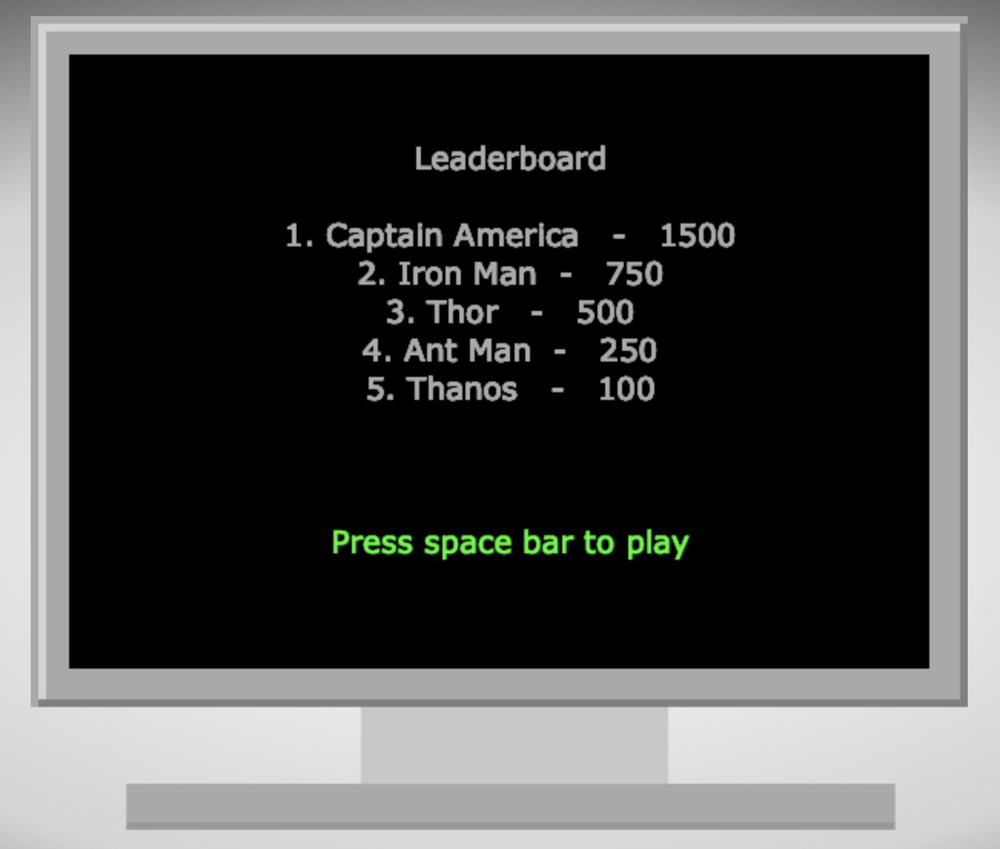
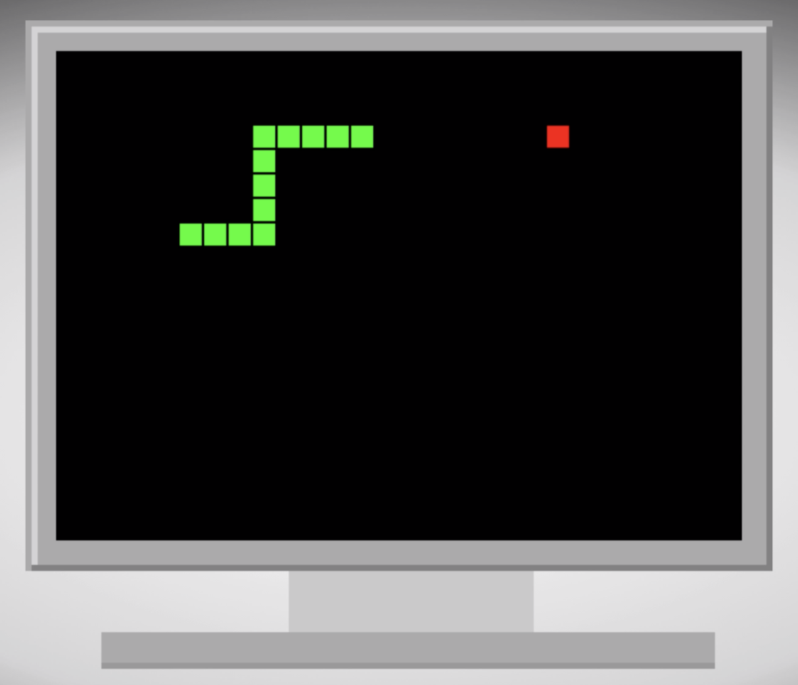

# snake
Snake built using HTML5 Canvas & Javascript. The basic game logic was built using the help of a Youtube video.

## Current Status
Complete. I finished this enough to enjoy playing the game, however, I know there are bugs with it. If I end up learning more about HTML5 games and game state, I may end up changing up the logic to make the game better.

https://richardtaylordawson.github.io/snake/

 
